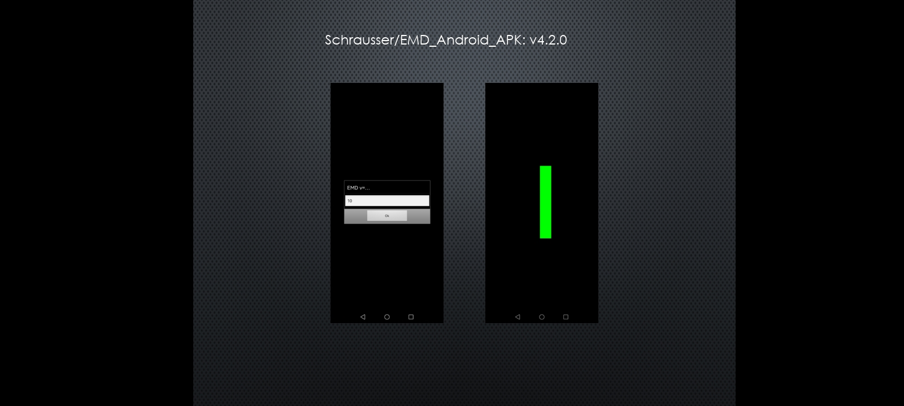
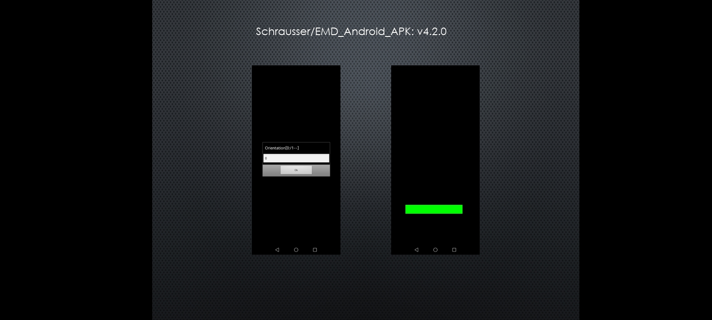
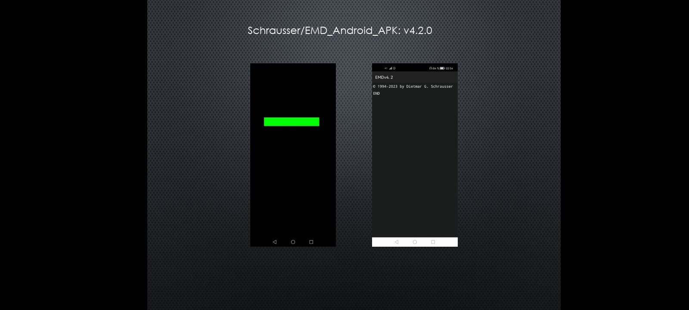

## EMD_Android_APK
[Demo movie](https://m.youtube.com/watch?v=n8u1iLaO1cQ)

Android application to simulate parts of EMDR Procedure implemented by Schrausser et al. (1994, 2022, respectively). Android versions 4.0 or later.

### Files

- Source: emd.bas
- Include: strg.inc, sigma.inc

### Screenshots

### References

Schrausser, D. G., Draxler, J., & Plechinger J. (1994). EMD - Eye Movement Desensitization. *Manuskript*. Institut für Psychologie, Karl Franzens Universität, Graz, Austria. http://doi.org/10.13140/RG.2.2.28498.02247/2
 
Schrausser, D. G., Draxler, J., & Plechinger J. (2022). EMD - Eye Movement Desensitization. *Manuscript*. (English translation). Institute of Psychology, Karl Franzens University, Graz, Austria. http://doi.org/10.13140/RG.2.2.13968.38404

Schrausser, D. G. (2023). *Schrausser/EMD_Android_APK: v4.5 (v4.5.7)*. Zenodo. https://doi.org/10.5281/zenodo.7644237
   
Schrausser, D. G. (2023). EMDA: Treatment procedure for lateral Eye Movement
Desensitization. PsyArXiv. https://doi.org/10.31234/osf.io/n2r5z.
