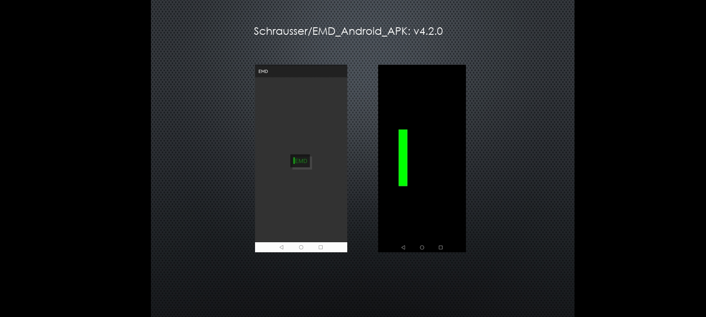

## EMD_Android_APK
Android basic source (BASIC!, Laughton, 2011) to simulate parts of EMD Procedure implemented by Schrausser et al. (1994, 2022, respectively). Android versions 4.0 or later.

### Files

- Source: emd.bas
- Include: strg.txt
- Install: EMDv4.2.0.apk

### References

Laughton, P. (2011). De Re BASIC!. *Manual*. https://github.com/RFO-BASIC/De-Re-Basic.

Schrausser, D. G., Draxler, J., & Plechinger J. (1994). EMD - Eye Movement Desensitization. *Manuskript*. Institut für Psychologie, Karl Franzens Universität, Graz, Austria. http://doi.org/10.13140/RG.2.2.28498.02247/1
 
Schrausser, D. G., Draxler, J., & Plechinger J. (2022). EMD - Eye Movement Desensitization. *Manuscript*. (English translation). Institute of Psychology, Karl Franzens University, Graz, Austria. https://www.researchgate.net/publication/367050282

Schrausser, D. G. (2023). Schrausser/EMD_Android_APK: v4.2.0 (v4.2.0). Zenodo. https://doi.org/10.5281/zenodo.7678447
   

